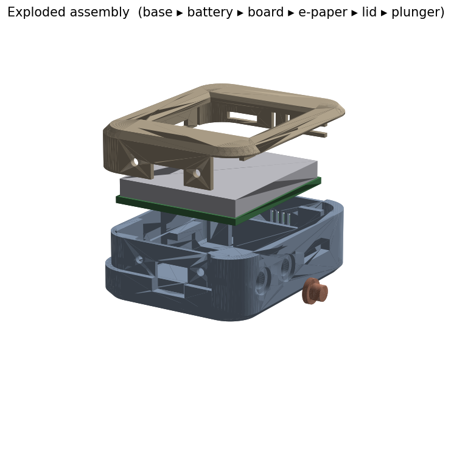
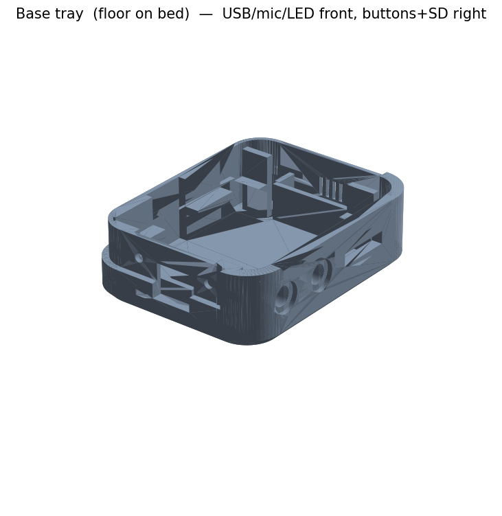
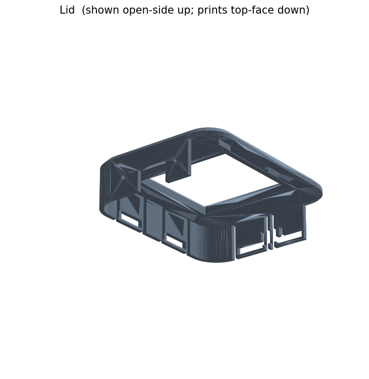

# Pala-style voice-note enclosure — parametric, snap-fit, no-supports

A two-part 3D-printable case for a DIY pocket voice recorder built on the
**Waveshare ESP32-S3 1.54inch e-Paper AIoT Development Board**
(`ESP32-S3-ePaper-1.54`, 200×200 B/W e-paper, onboard mic, speaker header,
microSD, RTC, LiPo charger) plus a 3.7 V **503035** LiPo. This is the board the
[Pala Note](https://ko-fi.com/s/a7cbbb8886) project uses — Waveshare lists Pala
Note in that board's community showcase.

Built with a real CAD kernel (**build123d** → OpenCASCADE), so the fillets,
chamfers and booleans are exact. Validated for manifoldness, component
interference, clearances, wall thickness and printability.



| | |
|---|---|
|  |  |

## Parts

| File | What | Print orientation | Est. mass @20% infill |
|---|---|---|---|
| `base.stl` | Battery + board tray, all wall openings, snap barbs | exterior floor on bed | ~7.7 g |
| `lid.stl` | Display window + snap skirt | **top face on bed** (skirt up) | ~2.7 g |
| `plunger.stl` | Side-button pin — **print 2** | cap face on bed | ~0.1 g each |

`.step` versions are included for FreeCAD, and `.3mf` (print-oriented,
unit-tagged) for slicers. All three formats are written by `export.py` — do not
hand-export, or they drift apart.

## Dimensions

- **Exterior:** 41.5 × 52.9 × 17.6 mm (W × L × H)
- **Interior cavity:** 36.7 × 48.1 mm, 13.6 mm deep
- **Display window:** 28.0 mm square (active area 27 mm + 0.5 mm reveal per
  side; the lid bezel overlaps the panel border to hide the panel edge and
  driver)
- **Wall:** 2.4 mm (0.95 mm at the rebated skirt shoulder — still ≥ 0.8 mm)
- **Outer vertical edges** filleted R8.0; **top/bottom rims** chamfered 1.6 mm

## Print settings

- **Nozzle 0.4 mm, layer 0.2 mm**, no thinnest feature below 0.8 mm
- **No supports needed.** Overhang handling:
  - Base seat ledges and rib tops each have a 45° chamfered underside.
  - Widest bridge is the 9 mm USB slot top (< 10 mm).
  - Lid prints top-face-down: the skirt and bezel are upward extrusions; snap
    windows are holes in vertical walls (self-supporting).
- 3–4 perimeters recommended so the snap panels and 0.95 mm skirt shoulder are
  solid.
- **Filament:** PLA is fine and what the mass estimate assumes (1.24 g/cm³). For
  a case that lives in a warm pocket or car, **PETG** is a better call — tougher
  snap cantilevers and no heat-creep. Avoid brittle/filled PLA for the plungers
  and snap panels.

## Assembly order

1. Desolder the board's stock 2×6 female expansion header if fitted — the
   reference case leaves only ~7.9 mm behind the PCB and the header is ~8.5 mm.
   (Pala Note firmware doesn't need it.)
2. Drop the **503035 battery** into the floor bay (long axis along the case
   length); route its lead toward the board's MX1.25 connector.
3. Seat the **board** onto the four corner seat-ledges, display facing up. The
   side rails and end stops locate it; the lid bezel provides the final clamp.
4. Push a **plunger** into each of the two right-edge button bores **from the
   outside**, stem first, until the cap seats in its recess (it sits 0.2 mm
   proud). The cap is wider than the bore, so it cannot fall inward; the side
   switch behind it holds it out against that seat.
5. Set the **lid** on and press until the four snaps click. The three-sided
   skirt keys the alignment; the button (right) wall has no skirt so the
   plunger caps stay free.

To open: flex the two −X-wall snap panels outward and lift.

## Snap-fit — cantilever strain check

The lid skirt is **slotted into discrete panels** so each snap behaves as a
real cantilever, not a stiff continuous hoop. Peak strain:

```
eps = 1.5 · t · y / L²
    = 1.5 · 1.2 · 0.5 / 7.0²          t=skirt 1.2, y=deflection 0.5, L=beam 7.0
    = 1.84 %      < 2 %  ✓
```

The barb stands 0.75 mm proud; the 0.25 mm skirt clearance is taken up first,
so the beam actually deflects 0.5 mm and the barb still penetrates the catch
window by 0.5 mm. (The brief flagged a prior 8.6 % design whose skirt was too
short — hence the deliberately long 7 mm beam.)

## Parameters — everything lives in `params.py`

| Parameter | Default | Controls |
|---|---|---|
| `CLEARANCE` | 0.25 | per-side gap at every part/component interface |
| `WALL_T` / `FLOOR_T` / `LID_T` | 2.4 / 2.0 / 2.0 | shell thicknesses |
| `EDGE_FILLET_R` | 8.0 | outer vertical edge fillet — sets the pebble silhouette |
| `RIM_CHAMFER` | 1.6 | top/bottom rim chamfer (**not** a fillet — both edges print on the bed) |
| `PCB_W` / `PCB_L` / `PCB_T` | 33 / 39 / 1.6 | board envelope |
| `PANEL_W/L/T`, `ACTIVE` | 31.8 / 37.32 / 1.18, 27 | e-paper panel + active area |
| `ACTIVE_CTR_X/Y` | 0.55 / 3.0 | active-area (window) offset from PCB center |
| `WINDOW_REVEAL` | 0.5 | window oversize past active area (bezel overlap) |
| `BATT_L/W/T` | 37 / 30.5 / 5.3 | 503035 max envelope |
| `SKIRT_T` / `SKIRT_DEPTH` | 1.2 / 8.0 | lid skirt wall + engagement depth |
| `SNAP_BARB_H` | 0.75 | barb proudness (drives strain + retention) |
| `SNAP_ENGAGE_DEPTH` | 7.0 | snap cantilever length L |
| `SNAP_PANEL_L` | 18.0 | width of each flexing skirt panel |
| `USB_OPEN_W/H` | 9.0 / 7.0 | USB-C opening |
| `SD_SLOT_L/H` | 12.2 / 2.8 | microSD slot opening |
| `BTN_BORE_D` / `BTN_STEM_D` | 4.2 / 3.8 | bore + stem (0.2 mm radial sliding fit) |
| `BTN_CAP_D` / `BTN_CAP_L` | 6.0 / 1.2 | plunger cap — wider than the bore, so it cannot fall inward |
| `SPK_L/W`, `SPK_GRILL_SLOTS` | 16 / 5, 4 | speaker bay + grille slits |
| `MIC_HOLE_D` / `PINHOLE` | 2.0 / 2.0 | mic + LED pinholes |

Change a value, re-run `python export.py && python validate.py`.

## Which dimensions were sourced vs guessed

**Waveshare publishes no bare-PCB drawing for this board** — only its cased
outline. Board-envelope and interface positions here were **measured by OCCT
section analysis of the Pala Note reference case STEP**
(`thegilbertchan/pala-note`, `hardware/Assembled.step`) and are marked
`[case-meas]` in `params.py`. That STEP's license restricts redistribution, so
it is used only as a dimensional reference and is **not** included here; this
enclosure is an independent parametric design.

**Sourced (datasheet / vendor):**
- Board identity & display: 200×200 1.54" e-paper, active area **27 × 27 mm**
  — [Waveshare docs](https://docs.waveshare.com/ESP32-S3-ePaper-1.54),
  [panel datasheet](https://files.waveshare.com/wiki/common/1.54inch_e-paper_V2_Datasheet.pdf)
- Panel outline 37.32 × 31.8 mm — panel datasheet (decimal digits partly
  garbled in the PDF text layer; industry-standard equivalent used)
- 503035 LiPo envelope **37 × 30.5 × 5.3 mm** incl. protection circuit —
  [LiPol LP503035 datasheet](https://www.lipolbattery.com/LiPo-Battery-Datahseet/LiPo_Battery_LP503035_3.7V_500mAh.pdf)
- Case window 27.8 mm @ 14.3 mm from bottom, screw spacing 28.1 mm — Waveshare
  cased-dimension drawing

**Measured from reference case (`[case-meas]`):** PCB envelope 33 × 39,
window/active offset, button + SD + USB + mic/LED + speaker positions and
opening sizes.

**Guessed (`# GUESS:` in code, no source):**
- `PCB_T` 1.6 mm — standard FR4, not published
- Back-side component keepout depths (`BACK_CLEAR_MID` 1.5, `BACK_CLEAR_EDGE`
  3.5)
- `USB_CTR_Z`, `BTN_CTR_Z`, `SWITCH_TIP_X` — vertical/edge positions of the
  USB shell and side switches (no published Z data; verify on a test print)
- `MIC_CTR_Z` / `LED_CTR_Z` pinhole heights

## Pushback / changes from the original brief

The brief was written for a **XIAO ESP32S3 Sense + separate 2.13" e-Paper HAT**.
After confirming the target is the Pala Note BOM, several spec points had to
change — flagged here rather than worked around silently:

1. **Board changed** to the integrated Waveshare ESP32-S3-ePaper-1.54 (what
   Pala Note actually uses). The XIAO/HAT parameter work is preserved on the
   `xiao-hat-variant` git branch.
2. **No M2 standoffs / screw mounting.** This board (like the XIAO before it)
   has no usable mounting holes — the stock case *clamps* the PCB. Replaced
   with corner seat-ledges + side locators + lid-bezel clamp.
3. **Onboard buttons, not a discrete 6×6 switch.** The board's two side
   tactile switches are actuated by two printed plungers through the right
   wall.
4. **Display FPC routing** (a brief concern for the HAT) doesn't apply — the
   panel is bonded to this board; no ribbon routing inside the case.
5. **Stock expansion header must be removed** to fit — documented in assembly.

## Reproduce

Run from the **workspace root** (the venv and `requirements.txt` are shared
there, one level up from this project):

```bash
python3 -m venv .venv && source .venv/bin/activate   # once, at workspace root
pip install -r requirements.txt
python note/src/params.py     # parameter sanity + arithmetic
python note/src/validate.py   # full validation suite (must pass)
python note/src/export.py     # -> note/models/stl/*.stl + note/models/step/*.step
python note/src/render.py     # -> note/renders/*.png
```

## Layout

This project (`note/`) lives inside a workspace that can hold several 3D-print
projects. General-purpose files (`.venv/`, `requirements.txt`, `.gitignore`)
stay at the workspace root and are shared; everything below is this project's:

```
note/
├── src/          all Python (params, components, base, lid, validate, export, render)
├── models/stl/   print-oriented base.stl, lid.stl, plunger.stl
├── models/step/  base.step, lid.step, plunger.step  (FreeCAD)
├── renders/      isometric + exploded PNG previews
└── docs/         original project brief
```

## Validation output

```
Building solids (OCCT kernel)...

1. Manifold / watertight / positive volume
  [PASS] base: positive volume (9.69 cm3)
  [PASS] base: watertight mesh
  [PASS] base: consistent winding (oriented)
  [PASS] base: single connected body (1)
        base: 1441 V, 2922 F, euler -20
  [PASS] lid: positive volume (3.38 cm3)
  [PASS] lid: watertight mesh
  [PASS] lid: consistent winding (oriented)
  [PASS] lid: single connected body (1)
        lid: 689 V, 1398 F, euler -10
  [PASS] plunger: positive volume (0.06 cm3)
  [PASS] plunger: watertight mesh
  [PASS] plunger: consistent winding (oriented)
  [PASS] plunger: single connected body (1)
        plunger: 252 V, 500 F, euler 2

2. Self-intersection
  [PASS] base: no self-intersection (watertight+oriented+non-degenerate)
  [PASS] lid: no self-intersection (watertight+oriented+non-degenerate)
  [PASS] plunger: no self-intersection (watertight+oriented+non-degenerate)

3. Interference checks (exact OCCT boolean volumes)
  [PASS] component 'battery' vs enclosure = 0.00 mm3 (< 2.0)
  [PASS] component 'pcb' vs enclosure = 0.00 mm3 (< 2.0)
  [PASS] component 'display' vs enclosure = 0.00 mm3 (< 2.0)
  [PASS] component 'back_mid' vs enclosure = 0.00 mm3 (< 2.0)
  [PASS] component 'usb' vs enclosure = 0.00 mm3 (< 2.0)
  [PASS] component 'sd' vs enclosure = 0.94 mm3 (< 2.0)
  [PASS] component 'speaker' vs enclosure = 0.00 mm3 (< 2.0)
  [PASS] component 'switch1' vs enclosure = 0.84 mm3 (< 2.0)
  [PASS] component 'switch2' vs enclosure = 0.84 mm3 (< 2.0)
  [PASS] internal: battery ∩ display = 0.000 mm3 (== 0)
  [PASS] internal: battery ∩ pcb = 0.000 mm3 (== 0)
  [PASS] internal: pcb ∩ display = 0.000 mm3 (== 0)
  [PASS] battery top 5.30 <= PCB back 7.50
  [PASS] base structure ∩ battery envelope = 0.000 mm3 (== 0)

4. Assembled skirt-to-wall clearance == CLEARANCE
  [PASS] wall-outer (-19.30) − skirt-inner (-19.55) = 0.25 mm ≈ CLEARANCE 0.25
  [PASS] barb penetration past skirt inner face = 0.50 mm (>= 0.4)

5. Wall-thickness report (flag < MIN_FEATURE)
  base:
     floor (Z up @ center)        2.00 mm
     -Y wall (Y+ @ solid)         1.20 mm
     +X wall (X+ @ mid)           3.70 mm
     -X rebated wall (X+)         2.55 mm
  lid:
     top plate (Z- @ corner)      2.00 mm
     skirt -X (X+)                1.20 mm
     bezel ring (Z-)              (no hit)

6. Print-mass estimate (PLA, 20% infill)
  base     solid  9.69 cm3 -> ~  7.7 g (shell 55% + 20% infill)
  lid      solid  3.38 cm3 -> ~  2.7 g (shell 55% + 20% infill)
  plunger  solid  0.06 cm3 -> ~  0.1 g (shell 55% + 20% infill)
  plunger  solid  0.06 cm3 -> ~  0.1 g (shell 55% + 20% infill)
  TOTAL    ~10.4 g + 2nd plunger ~0.1 g

============================================================
VALIDATION PASSED — all hard checks green.
```
